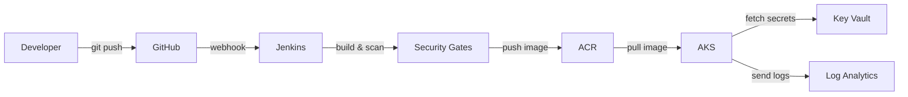
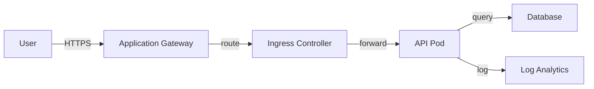
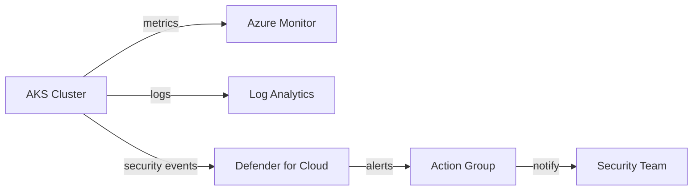

# Architecture Documentation

## Overview

This document describes the architecture of the DevSecOps portfolio platform, including infrastructure components, security controls, and data flows.

---

## Architecture Diagram


---

## Components

### 1. CI/CD Pipeline (Jenkins)

**Purpose**: Automate build, test, security scanning, and deployment processes.

**Security Gates**:
1. **SAST (Semgrep)**: Static code analysis for security vulnerabilities
2. **Secrets Scanning (Gitleaks)**: Detect hardcoded secrets
3. **SCA (Dependency-Check)**: Identify vulnerable dependencies
4. **Container Scanning (Trivy)**: Scan Docker images for vulnerabilities
5. **IaC Scanning (Checkov)**: Validate Terraform and Kubernetes configurations
6. **SBOM Generation (Syft)**: Create Software Bill of Materials
7. **DAST (OWASP ZAP)**: Dynamic security testing in staging

**Pipeline Flow**:
```
Code → Build → SAST → Secrets → SCA → Container Build → 
Container Scan → IaC Scan → SBOM → Deploy Staging → 
DAST → Manual Approval → Deploy Production
```

---

### 2. Azure Kubernetes Service (AKS)

**Configuration**:
- **Kubernetes Version**: 1.28.3
- **Node Pools**: 
  - System pool: 2-5 nodes (auto-scaling)
  - User pool: 2-10 nodes (auto-scaling)
- **VM Size**: Standard_D2s_v3
- **Network Plugin**: Azure CNI
- **Network Policy**: Azure Network Policy

**Security Features**:
- Azure AD integration for RBAC
- Managed identity for Azure resource access
- Private cluster option available
- Pod Security Standards enforced
- Network policies for micro-segmentation
- Key Vault Secrets Provider integration
- Microsoft Defender for Containers enabled

**Namespaces**:
- `staging`: Pre-production environment
- `production`: Production environment
- `monitoring`: Observability tools
- `ingress-nginx`: Ingress controller

---

### 3. Azure Container Registry (ACR)

**Configuration**:
- **SKU**: Premium (required for security features)
- **Admin Account**: Disabled (use managed identities)
- **Quarantine Policy**: Enabled
- **Content Trust**: Enabled
- **Retention Policy**: 7 days for untagged manifests

**Security Features**:
- Vulnerability scanning with Defender
- Image signing support (Cosign)
- Network rules restrict access to AKS and Jenkins subnets
- Diagnostic logging to Log Analytics
- Geo-replication for high availability (optional)

**Image Naming Convention**:
```
<acr-name>.azurecr.io/<image-name>:<build-number>-<git-sha>
<acr-name>.azurecr.io/<image-name>:latest
```

---

### 4. Azure Key Vault

**Purpose**: Centralized secrets management for applications and infrastructure.

**Configuration**:
- **SKU**: Premium (HSM-backed keys)
- **Purge Protection**: Enabled
- **Soft Delete**: 7 days retention
- **RBAC Authorization**: Enabled
- **Network ACLs**: Allow from AKS and Jenkins subnets

**Secrets Stored**:
- Database connection strings
- API keys for external services
- TLS certificates
- Service principal credentials
- Application secrets

**Access**:
- AKS pods access via CSI driver
- Jenkins accesses via service principal
- Developers access via Azure AD RBAC

---

### 5. Virtual Network (VNet)

**Address Space**: 10.0.0.0/16

**Subnets**:
- **AKS Subnet**: 10.0.1.0/24
  - Hosts AKS nodes
  - Network policies enforced
- **Jenkins Subnet**: 10.0.2.0/24
  - Hosts Jenkins VM
  - NSG with restricted access
- **Application Gateway Subnet**: 10.0.3.0/24
  - Ingress traffic

**Network Security**:
- Network Security Groups (NSGs) on each subnet
- Azure Firewall for egress filtering (optional)
- DDoS Protection Standard (optional)

---

### 6. Monitoring & Observability

#### Log Analytics Workspace
- **Retention**: 30 days
- **Data Sources**:
  - AKS container logs
  - Azure resource diagnostic logs
  - Application logs
  - Security audit logs

#### Azure Monitor
- **Container Insights**: Enabled for AKS
- **Metrics**: CPU, memory, network, disk
- **Alerts**: Configured for critical thresholds
- **Action Groups**: Email and webhook notifications

#### Application Insights
- **Application Type**: Web
- **Features**:
  - Request tracking
  - Dependency tracking
  - Exception tracking
  - Custom metrics

#### Microsoft Defender for Cloud
- **Plans Enabled**:
  - Defender for Containers
  - Defender for Container Registries
  - Defender for Key Vaults
- **Features**:
  - Vulnerability assessment
  - Runtime threat detection
  - Compliance dashboard
  - Security recommendations

---

## Data Flows

### 1. Application Deployment Flow



### 2. User Request Flow



### 3. Security Monitoring Flow



---

## Security Architecture

### Defense in Depth Layers

1. **Perimeter Security**
   - Azure DDoS Protection
   - Application Gateway with WAF
   - Network Security Groups

2. **Network Security**
   - Azure CNI with network policies
   - Micro-segmentation between pods
   - Private endpoints for Azure services

3. **Identity & Access**
   - Azure AD integration
   - RBAC for Kubernetes
   - Managed identities (no credentials in code)
   - Least privilege principle

4. **Application Security**
   - SAST, SCA, DAST in pipeline
   - Container image scanning
   - Runtime security with Defender
   - Input validation and sanitization

5. **Data Security**
   - Encryption at rest (Azure Storage Encryption)
   - Encryption in transit (TLS 1.2+)
   - Secrets in Key Vault
   - Database encryption

6. **Monitoring & Response**
   - Centralized logging
   - Real-time alerting
   - Incident response runbook
   - Audit trails

---

## High Availability & Disaster Recovery

### High Availability

- **AKS**: Multi-node pools with auto-scaling
- **ACR**: Geo-replication (optional)
- **Key Vault**: Zone-redundant (Premium SKU)
- **Application**: Multiple replicas with health checks

### Disaster Recovery

- **Infrastructure**: Terraform state enables rapid rebuild
- **Application**: GitOps approach, all config in Git
- **Data**: Database backups (to be implemented)
- **RTO**: < 4 hours (infrastructure rebuild)
- **RPO**: < 1 hour (for stateful data)

---

## Scalability

### Horizontal Scaling

- **AKS Nodes**: Auto-scaling (2-10 nodes)
- **Application Pods**: Horizontal Pod Autoscaler (HPA)
- **Database**: Azure Database for PostgreSQL with read replicas

### Vertical Scaling

- **Node Size**: Can upgrade to larger VM sizes
- **Pod Resources**: Adjust limits/requests as needed

---

## Compliance & Governance

### Frameworks Addressed

- **ISO 27001/27002**: Information security controls
- **NIST CSF**: Cybersecurity framework
- **CIS Controls**: Security best practices
- **ISO 22301**: Business continuity
- **ISO 27701**: Privacy management

### Governance Tools

- **Azure Policy**: Enforce compliance rules
- **Terraform**: Infrastructure as Code
- **Git**: Version control and audit trail
- **Change Control**: Documented approval process

---

## Cost Optimization

### Strategies

1. **Auto-scaling**: Scale down during low usage
2. **Reserved Instances**: For predictable workloads
3. **Spot Instances**: For non-critical workloads
4. **Right-sizing**: Monitor and adjust VM sizes
5. **Retention Policies**: Limit log and image retention

### Estimated Monthly Cost (Dev Environment)

| Service | Estimated Cost |
|---------|---------------|
| AKS (2-5 nodes) | $150-350 |
| ACR Premium | $20 |
| Key Vault | $5 |
| Log Analytics | $10-50 |
| Defender for Cloud | $15 |
| **Total** | **$200-440** |

*Production environment would be higher due to more nodes, geo-replication, etc.*

---

## Future Enhancements

### Short-term (1-3 months)
- [ ] Implement OPA Gatekeeper for advanced policies
- [ ] Add image signing with Cosign
- [ ] Set up Microsoft Sentinel for SIEM
- [ ] Implement GitOps with ArgoCD or Flux

### Medium-term (3-6 months)
- [ ] Service mesh (Istio or Linkerd)
- [ ] Chaos engineering with Chaos Mesh
- [ ] Advanced monitoring with Grafana
- [ ] Multi-region deployment

### Long-term (6-12 months)
- [ ] Zero-trust networking with Azure Firewall
- [ ] Advanced threat protection
- [ ] Compliance automation
- [ ] AI/ML for anomaly detection

---

## References

- [Azure AKS Documentation](https://docs.microsoft.com/en-us/azure/aks/)
- [Azure Security Best Practices](https://docs.microsoft.com/en-us/azure/security/)
- [Kubernetes Security](https://kubernetes.io/docs/concepts/security/)
- [DevSecOps Best Practices](https://www.devsecops.org/)

---

**Document Version**: 1.0  
**Last Updated**: 2026-02-04  
**Author**: DevSecOps Team
