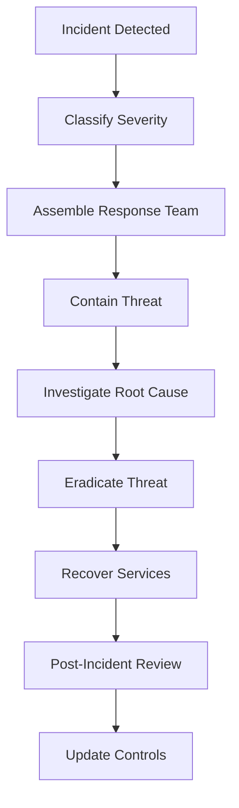

# Incident Response Runbook

## Overview

This runbook provides step-by-step procedures for responding to security incidents in the DevSecOps platform.

---

## Incident Classification

### Severity Levels

| Level | Description | Response Time | Examples |
|-------|-------------|---------------|----------|
| **P1 - Critical** | Production down, data breach, active attack | Immediate (15 min) | Container compromise, secrets leaked publicly |
| **P2 - High** | Significant security risk, degraded service | 1 hour | Critical vulnerability in production, failed security scan |
| **P3 - Medium** | Security concern, no immediate impact | 4 hours | Medium vulnerability, policy violation |
| **P4 - Low** | Minor issue, informational | 24 hours | Low severity vulnerability, configuration drift |

---

## Incident Response Team

| Role | Responsibilities | Contact |
|------|------------------|---------|
| **Incident Commander** | Overall coordination, decision making | On-call rotation |
| **Security Lead** | Security analysis, threat assessment | Security team |
| **DevOps Lead** | Infrastructure, deployment actions | DevOps team |
| **Communications Lead** | Stakeholder communication | Management |

---

## General Incident Response Process



---

## Scenario 1: Critical Vulnerability in Production Container

### Detection
- Trivy scan in pipeline detects critical CVE
- Defender for Containers alerts on running vulnerable container
- Security team receives alert via Azure Monitor

### Response Steps

#### 1. Immediate Actions (0-15 minutes)
```bash
# Verify the vulnerability
az acr repository show-tags --name devsecopsacr --repository api

# Check running pods
kubectl get pods -n production -o wide

# Review Trivy report
cat trivy-api-report.json | jq '.Results[].Vulnerabilities[] | select(.Severity=="CRITICAL")'
```

#### 2. Assess Impact (15-30 minutes)
- [ ] Determine if vulnerability is exploitable in current configuration
- [ ] Check if vulnerability is being actively exploited (check logs)
- [ ] Identify affected services and data

```bash
# Check application logs for suspicious activity
kubectl logs -n production deployment/devsecops-api --tail=1000 | grep -i "error\|exception\|unauthorized"

# Query Log Analytics for anomalies
# Use Azure Portal or Azure CLI
```

#### 3. Containment (30-60 minutes)

**Option A: Patch Available**
```bash
# Build new image with patched dependencies
cd app/api
# Update requirements.txt or Dockerfile base image
docker build -t api:patched .

# Run security scan
trivy image api:patched

# If clean, deploy via pipeline or manual
helm upgrade devsecops-app ./k8s/helm-chart \
  --namespace production \
  --set api.image.tag=patched \
  --wait
```

**Option B: No Patch Available (Temporary Mitigation)**
```bash
# Scale down affected deployment
kubectl scale deployment devsecops-api -n production --replicas=0

# Deploy previous known-good version
helm rollback devsecops-app -n production

# Implement compensating controls (e.g., WAF rules, network policies)
```

#### 4. Communication
- [ ] Notify stakeholders of issue and mitigation status
- [ ] Update status page if customer-facing
- [ ] Document timeline in incident ticket

#### 5. Recovery
```bash
# Verify patched version is running
kubectl get pods -n production
kubectl describe pod <pod-name> -n production

# Run smoke tests
curl https://api.example.com/health
curl https://api.example.com/api/items

# Monitor for errors
kubectl logs -f deployment/devsecops-api -n production
```

#### 6. Post-Incident Actions
- [ ] Update vulnerability management process
- [ ] Add additional scanning rules if needed
- [ ] Review dependency update cadence
- [ ] Schedule post-mortem meeting

---

## Scenario 2: Secrets Leaked in Repository

### Detection
- Gitleaks scan in pipeline detects secret
- GitHub secret scanning alert
- Manual report from team member

### Response Steps

#### 1. Immediate Actions (0-5 minutes)
```bash
# Identify the leaked secret
cat gitleaks-report.json

# Determine secret type (API key, password, certificate, etc.)
```

#### 2. Revoke Compromised Credentials (5-15 minutes)

**For Azure Service Principal:**
```bash
# Reset service principal credentials
az ad sp credential reset --id <app-id>

# Update in Key Vault
az keyvault secret set --vault-name devsecops-kv --name sp-secret --value <new-secret>
```

**For API Keys:**
```bash
# Revoke old key in provider dashboard
# Generate new key
# Update in Key Vault
az keyvault secret set --vault-name devsecops-kv --name api-key --value <new-key>
```

**For Database Passwords:**
```bash
# Rotate database password
# Update in Key Vault
# Restart pods to pick up new secret
kubectl rollout restart deployment/devsecops-api -n production
```

#### 3. Remove Secret from Git History
```bash
# Use BFG Repo-Cleaner or git-filter-repo
git filter-repo --path <file-with-secret> --invert-paths

# Force push (coordinate with team)
git push origin --force --all
```

#### 4. Audit Access
```bash
# Check if secret was used
az monitor activity-log list --resource-group devsecops-rg --start-time <leak-time>

# Review Key Vault audit logs
az monitor diagnostic-settings show --resource <keyvault-id>
```

#### 5. Implement Preventive Measures
- [ ] Add pre-commit hook for Gitleaks
- [ ] Enable GitHub secret scanning
- [ ] Review secrets management training
- [ ] Update documentation on secret handling

---

## Scenario 3: Container Image Compromised

### Detection
- Unusual container behavior (high CPU, network activity)
- Defender for Containers runtime alert
- Anomalous process execution detected

### Response Steps

#### 1. Isolate Affected Pods (0-10 minutes)
```bash
# Identify suspicious pods
kubectl get pods -n production -o wide

# Cordon node to prevent new pods
kubectl cordon <node-name>

# Create network policy to isolate pod
kubectl apply -f - <<EOF
apiVersion: networking.k8s.io/v1
kind: NetworkPolicy
metadata:
  name: isolate-compromised-pod
  namespace: production
spec:
  podSelector:
    matchLabels:
      app: devsecops-api
  policyTypes:
  - Ingress
  - Egress
  ingress: []
  egress: []
EOF
```

#### 2. Collect Forensic Data (10-30 minutes)
```bash
# Capture pod logs
kubectl logs <pod-name> -n production > compromised-pod-logs.txt

# Describe pod for events
kubectl describe pod <pod-name> -n production > pod-description.txt

# Exec into pod for investigation (if safe)
kubectl exec -it <pod-name> -n production -- /bin/sh
# Check running processes
ps aux
# Check network connections
netstat -tulpn
# Check file modifications
find / -mtime -1 -type f
```

#### 3. Terminate Compromised Pods
```bash
# Delete pod
kubectl delete pod <pod-name> -n production

# Delete deployment if entire deployment compromised
kubectl delete deployment devsecops-api -n production
```

#### 4. Investigate Image Source
```bash
# Check image provenance
az acr repository show --name devsecopsacr --repository api

# Review image build logs in Jenkins
# Verify image signature (if using Cosign)
cosign verify <image>

# Scan image again
trivy image <image>
```

#### 5. Rebuild and Redeploy
```bash
# Rebuild from clean source
git checkout <known-good-commit>
# Trigger pipeline or manual build
# Deploy verified clean image
```

#### 6. Root Cause Analysis
- [ ] How was image compromised? (supply chain, build process, registry)
- [ ] What vulnerabilities were exploited?
- [ ] What data was accessed?
- [ ] What systems were affected?

---

## Scenario 4: Failed Security Scan in Pipeline

### Detection
- Jenkins pipeline fails at security gate
- High/Critical findings in SAST, SCA, or DAST

### Response Steps

#### 1. Review Scan Results (0-15 minutes)
```bash
# Download scan reports from Jenkins artifacts
# Review findings

# For SAST (Semgrep)
cat semgrep-report.sarif | jq '.runs[].results[] | select(.level=="error")'

# For SCA (Dependency-Check)
# Open dependency-check-report.html in browser

# For Container Scan (Trivy)
cat trivy-api-report.json | jq '.Results[].Vulnerabilities[] | select(.Severity=="CRITICAL" or .Severity=="HIGH")'
```

#### 2. Triage Findings (15-30 minutes)
- [ ] Separate true positives from false positives
- [ ] Assess exploitability and impact
- [ ] Prioritize by severity and ease of fix

#### 3. Remediation (30 minutes - hours)

**For Code Vulnerabilities (SAST):**
```python
# Example: Fix SQL injection
# Before:
query = f"SELECT * FROM users WHERE id = {user_id}"

# After:
query = "SELECT * FROM users WHERE id = ?"
cursor.execute(query, (user_id,))
```

**For Dependency Vulnerabilities (SCA):**
```bash
# Update vulnerable dependency
# In requirements.txt
# Before: requests==2.25.0
# After: requests==2.31.0

pip install -r requirements.txt
# Re-run tests
pytest
```

**For Container Vulnerabilities:**
```dockerfile
# Update base image
# Before: FROM python:3.11-slim
# After: FROM python:3.11.7-slim

# Or use distroless
FROM gcr.io/distroless/python3-debian11
```

#### 4. Re-run Pipeline
```bash
# Commit fixes
git add .
git commit -m "fix: resolve security vulnerabilities"
git push

# Trigger pipeline
# Verify all security gates pass
```

#### 5. Exception Process (if fix not immediately available)
- [ ] Document risk acceptance
- [ ] Implement compensating controls
- [ ] Set remediation deadline
- [ ] Get approval from security lead

---

## Scenario 5: AKS Cluster Breach

### Detection
- Unauthorized API calls to Kubernetes API
- Unexpected pod creation
- Defender for Cloud critical alert

### Response Steps

#### 1. Immediate Containment (0-10 minutes)
```bash
# Revoke suspicious credentials
kubectl delete serviceaccount <suspicious-sa> -n <namespace>

# Remove compromised RBAC bindings
kubectl delete rolebinding <binding-name> -n <namespace>

# Block suspicious IP at NSG level
az network nsg rule create \
  --resource-group devsecops-rg \
  --nsg-name devsecops-aks-nsg \
  --name BlockSuspiciousIP \
  --priority 100 \
  --source-address-prefixes <suspicious-ip> \
  --access Deny
```

#### 2. Audit and Investigation (10-60 minutes)
```bash
# Review Kubernetes audit logs
kubectl get events --all-namespaces --sort-by='.lastTimestamp'

# Query Log Analytics for suspicious activity
# Use KQL queries in Azure Portal

# Check for unauthorized resources
kubectl get all --all-namespaces
kubectl get secrets --all-namespaces
kubectl get configmaps --all-namespaces
```

#### 3. Eradication
```bash
# Delete unauthorized resources
kubectl delete <resource-type> <resource-name> -n <namespace>

# Rotate all credentials
az aks rotate-certs --resource-group devsecops-rg --name devsecops-aks

# Update all secrets in Key Vault
```

#### 4. Recovery
```bash
# Restore from known-good state
terraform apply

# Redeploy applications
helm upgrade devsecops-app ./k8s/helm-chart --namespace production
```

#### 5. Strengthen Defenses
- [ ] Review and tighten RBAC policies
- [ ] Enable admission controllers (OPA Gatekeeper)
- [ ] Implement pod security policies
- [ ] Enable audit logging
- [ ] Review network policies

---

## Communication Templates

### Initial Notification (P1/P2)
```
SUBJECT: [P1] Security Incident - <Brief Description>

Team,

A security incident has been detected:
- Incident ID: INC-YYYYMMDD-###
- Severity: P1 (Critical)
- Description: <Brief description>
- Impact: <Affected systems/services>
- Status: Investigation in progress

Response team has been assembled. Updates will be provided every 30 minutes.

Next update: <Time>

Incident Commander: <Name>
```

### Status Update
```
SUBJECT: [P1] Security Incident Update - <Brief Description>

Update as of <Time>:

- Current Status: <Containment/Investigation/Recovery>
- Actions Taken: <Summary of actions>
- Next Steps: <Planned actions>
- ETA to Resolution: <Estimate>

Next update: <Time>
```

### Resolution Notification
```
SUBJECT: [RESOLVED] Security Incident - <Brief Description>

The security incident (INC-YYYYMMDD-###) has been resolved.

Summary:
- Root Cause: <Brief explanation>
- Impact: <What was affected>
- Resolution: <How it was fixed>
- Preventive Measures: <What was done to prevent recurrence>

A full post-incident review will be conducted on <Date>.

Thank you for your patience.
```

---

## Post-Incident Review Template

### Meeting Agenda
1. Incident timeline
2. What went well
3. What could be improved
4. Action items

### Documentation
- [ ] Complete incident report
- [ ] Update runbook with lessons learned
- [ ] Create action items in tracking system
- [ ] Update security controls if needed
- [ ] Share findings with team

---

## Escalation Paths

| Severity | Initial Contact | Escalation (30 min) | Escalation (1 hour) |
|----------|----------------|---------------------|---------------------|
| P1 | On-call engineer | Security Lead | CTO/CISO |
| P2 | On-call engineer | Team Lead | Security Lead |
| P3 | Team member | Team Lead | - |
| P4 | Team member | - | - |

---

## Contact Information

| Role | Name | Phone | Email |
|------|------|-------|-------|
| On-Call Engineer | Rotation | +1-555-0100 | oncall@example.com |
| Security Lead | Security Team | +1-555-0101 | security@example.com |
| DevOps Lead | DevOps Team | +1-555-0102 | devops@example.com |
| CTO/CISO | Management | +1-555-0103 | cto@example.com |

---

## Tools and Resources

- **Azure Portal**: https://portal.azure.com
- **Jenkins**: http://<jenkins-url>:8080
- **Log Analytics**: Azure Portal > Log Analytics workspaces
- **Defender for Cloud**: Azure Portal > Microsoft Defender for Cloud
- **Incident Tracking**: <Your ticketing system>
- **Communication**: <Slack/Teams channel>

---

**Last Updated**: 2026-02-04  
**Next Review**: 2026-05-04 (Quarterly)
